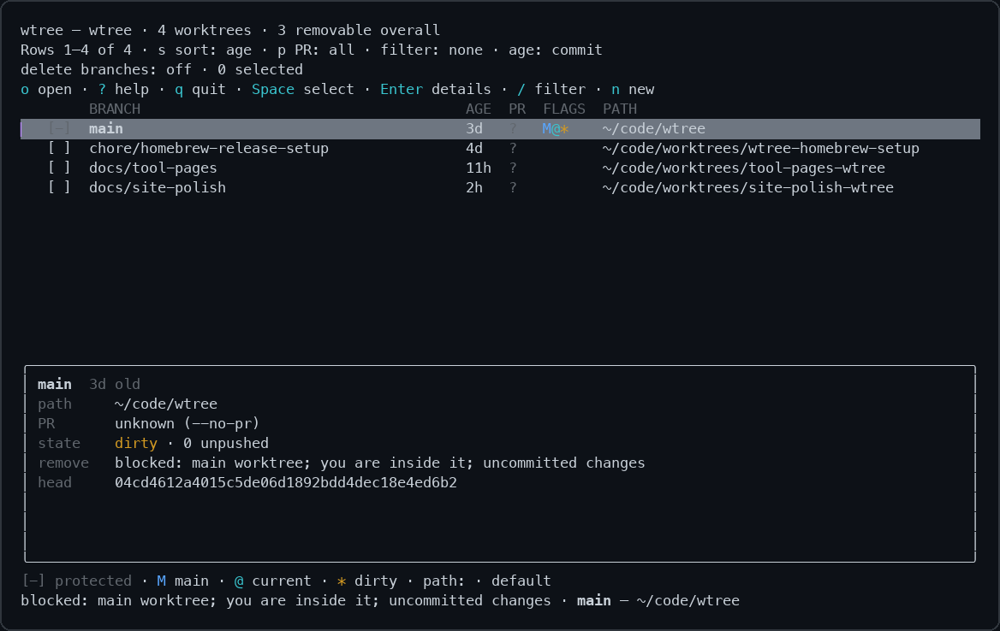

# wtree

See your Git worktrees, check their pull requests, and clean up finished work.

[](https://github.com/filipgutica/wtree/releases)
[](https://github.com/filipgutica/wtree/actions/workflows/ci.yml)
[](package.json)
[](.github/workflows/ci.yml)

**[Website](https://filipgutica.github.io/wtree/)** · **[Quick start](#quick-start)** · **[Commands](#commands)** · **[Safety rules](#safety-rules)**

wtree adds age, optional disk usage, and GitHub PR state to `git worktree list`.
Browse worktrees in an interactive UI, create new ones, or review a cleanup plan before removing them.

[](docs/site/wtree-ui.png)

Actual `wtree --no-pr ui` capture. PR state is unknown because lookup was disabled for the capture.

```text
$ wtree
BRANCH             AGE  PR            FLAGS  PATH
main               2d   -             M@     ~/code/demo-api
spike/flink-cdc    8mo  -             *      ~/code/demo-api-flink-spike
chore/bump-deps    5mo  closed #4390         ~/code/demo-api-bump-deps
feat/usage-charts  3mo  merged #4502         ·
fix/token-refresh  4h   open #4821    *      ·
flags: M main  @ current  * dirty  ↑ unpushed  L locked  P prunable  d detached  ✓ in default branch
   path: · in ~/.wtree/<repo>/<branch>
```

## Quick start

Install with Homebrew:

```sh
brew install filipgutica/tap/wtree
```

List the current repository's worktrees, open the browser, or preview cleanup:

```sh
wtree
wtree ui
wtree clean --done --dry-run
```

wtree requires Git and Node.js 20 or newer. [`gh`](https://cli.github.com) supplies GitHub PR state.
Without usable GitHub access, the list still works and shows PR state as `?`.
Cleanup with a PR-state filter stops with an error if that state is unavailable.

## Commands

### `wtree list` (default)

```sh
wtree                                  # every worktree, oldest first
wtree -s                               # -s / --size: measure disk usage with du
wtree --pr-state merged,closed         # only worktrees whose PR is done
wtree --done                           # same as --pr-state merged,closed
wtree --older-than 3mo                 # only worktrees older than three months
wtree --branch 'feat/*'                # glob on branch name
wtree --prunable                       # only ones git would prune
wtree -j                               # -j / --json: machine readable
```

A PATH of `·` means the worktree is at its default location,
`~/.wtree/<repo>/<branch>` (see `wtree new`). The main worktree and worktrees
elsewhere show their path. Piped output and `--json` always have the full path.

On a terminal, the list ends with hints when there is something to clean up,
for example `2 worktrees have merged/closed PRs — run wtree clean --done` or
`1 prunable — run wtree prune`.

### `wtree new`

Creates a worktree for a branch and prints its path. New worktrees live under
`~/.wtree/<repo>/<branch>`, where `<repo>` is the name of the main worktree's
directory. A branch with slashes nests: `feat/foo` in `api` lands in
`~/.wtree/api/feat/foo`.

```sh
wtree new feat/foo                     # local branch, else origin/feat/foo, else a new branch
wtree new feat/foo --from origin/dev   # start a new branch from origin/dev
wtree new feat/foo --no-fetch          # do not ask origin first
```

The start point is picked in this order:

1. The local branch, if it exists.
2. `origin/<branch>`, after a `git fetch` of that one branch. The new local
   branch tracks it.
3. The `--from` base, or the remote default branch (usually `origin/main`). The
   new branch has **no upstream**, so a bare `git push` cannot land on main.

If the fetch fails for any reason other than "the remote has no such branch", for
example no network, `wtree new` warns and carries on offline. If the branch
already has a worktree, `wtree new` prints that worktree's path and creates
nothing. If the target directory already exists, it exits **1**.

### `wtree go`

Picks a worktree or branch and prints its path. It uses `fzf` when it is
installed, and a numbered list otherwise. Existing worktrees come first, then
branches without a worktree, most recent commit first. Picking a branch without a
worktree creates one, as `wtree new` would.

The picker shows aligned worktree and branch rows. Its lower pane shows the full
branch, path, and action for the focused row. Enter selects; Esc cancels.

```sh
wtree go                               # pick from everything
wtree go auth                          # start the picker filtered on "auth"
wtree go feat/foo                      # exact branch: no picker
```

If you cancel, or nothing matches, `wtree go` exits **1** and prints nothing.
Without a terminal it exits **2**. It does not call GitHub, so it starts
quickly.

### `wtree path`

Prints the path of an existing worktree. `<name>` can be an exact branch, an
exact path, or a substring of either that matches only one worktree. No match
exits **1**. More than one match exits **2** and lists the matches on stderr.

```sh
cd "$(wtree path feat/foo)"
```

### Shell integration

`new`, `go` and `path` print exactly one line on stdout, the path. Everything
else goes to stderr. A program cannot change its parent shell's directory, so
`wtree shell-init` prints a small `wt` function that does the `cd` for you. Add
this line to `~/.zshrc` (or `~/.bashrc` with `bash`):

```sh
eval "$(wtree shell-init zsh)"
```

Then:

```sh
wt go                                  # pick, then cd there
wt new feat/x                          # create, then cd there
wt path main                           # cd back to main
wt ui                                  # browse; press o to cd into a worktree
```

Other subcommands pass straight through to `wtree`.

### `wtree clean`

Removes worktrees matching the filters. Interactive cleanup prints the plan and asks for confirmation.
`--dry-run` prints the plan without removing anything.
`--yes` skips the preview and confirmation for removable matches, unless `--dry-run` is also set.

```sh
wtree clean --pr-state merged,closed --older-than 3mo    # plan, then "Remove 3 worktrees? [y/N]"
wtree clean --done                                       # --done = --pr-state merged,closed
wtree clean --prunable -n                                # -n / --dry-run: plan only, never asks
wtree clean --pr-state merged -y -d                      # -y / --yes: no prompt; -d / --delete-branch
```

Short flags: `-n` dry run, `-y` yes, `-f` force, `-d` delete branch, `-j` JSON.
A skipped worktree says how to get past the block when a flag can:
`(--force to override)` or `(try --refresh)`. Each removed worktree whose branch
survived gets a `restore: wtree new <branch>` line. After a removal under
`~/.wtree/<repo>/`, empty parent directories such as `feat/` are removed too.

Without an interactive terminal (a pipe, script, agent, or `--json`), `clean`
prints the plan and exits **2** unless you passed `--yes` or `--dry-run`.
Use `--dry-run` to inspect the plan or `--yes` to execute it.

A bare `wtree clean` with no filter opens `wtree ui` to pick worktrees by hand,
but only on a terminal and without `--json`, `--yes` or `--dry-run`. In every
other case it exits **2** without a filter. Pass `--all` to consider every non-main worktree.

### `wtree rm`

Removes worktrees by exact name. Each `<name>` must be a worktree's exact branch
or exact path (relative paths resolve against the current directory). A
substring never matches, because this deletes. If any name matches nothing,
`rm` exits **2**, lists close matches on stderr, and removes nothing.

```sh
wtree rm feat/foo                      # plan, then ask
wtree rm feat/foo ../api-spike -y -d   # two worktrees, no prompt, delete branches
```

`rm` uses the same plan, confirmation, safety rules and options as `clean`.

### Prunable worktrees

A worktree is *prunable* (`P`) when Git can no longer validate it: its `.git`
file, or its whole directory, is gone. `git worktree remove` refuses those, so
`wtree` drops the record under `.git/worktrees` instead, one record at a time.

If the directory remains, `wtree` deletes it to reclaim disk space.
It deletes the directory **before** pruning the record, while Git's bookkeeping still identifies the path. It refuses to delete a directory that
contains the repo, the current directory, or a live `.git` entry, and
`--keep-directory` turns the deletion off.

### `wtree prune`

Wraps `git worktree prune`. Shows what it would drop, then asks. Same
`--dry-run` / `--yes` rules as `clean`.

### `wtree ui`

Interactive browser: move, multi-select, filter, create, open, and delete. It
draws on the terminal (`/dev/tty`), so stdout carries only the path you open
with `o`; with the `wt` wrapper, `wt ui` then `o` changes into that worktree.
Without a terminal it exits **2**, so it can never hang a script or an agent.
The list keeps a preview of the focused worktree below the table. Enter opens
the full, scrollable details screen.

| Key | Action |
| --- | --- |
| `j`/`k`, arrows | Move. `g`/`G` jump to top/bottom |
| `Space` | Select. Refuses a blocked worktree and says why |
| `f` | **Force select**, overriding dirty, unpushed or locked. Shows `[!]` |
| `a` / `F` | Select all removable / all force-removable |
| `c` | Clear the whole selection |
| `/` | Filter by branch or path. `s` sorts, `p` cycles PR state |
| `Enter` | Scrollable details with the complete branch and path |
| `w` / `y` | Open the focused worktree PR / copy its path, in the list or details |
| `o` | Open: exit and print the worktree's path |
| `n` | New worktree for a branch |
| `d` | Review removal of the whole selection, or the focused worktree, then confirm |
| `b` | Toggle branch deletion. `r` refresh, `S` measure sizes |
| `?` | Toggle the help popup with shortcuts and the flags/path legend |
| `q`, `Esc` | Quit |

Shortcuts appear above the table. The footer keeps the contextual flags and
selection legend visible.
Wider, taller terminals show more hints; smaller terminals prioritize the focused
worktree and available actions. The help popup uses at most about three quarters
of the terminal width and three fifths of its height, keeping the list visible
behind it. Use `j`/`k` or arrows to scroll,
`g`/`G` for the top/bottom, and `Esc`, `Enter` or `?` to close it. Cyan marks
shortcuts; green marks selection, yellow marks forceable blocks, and red marks
forced selection. Protected rows stay muted. All states keep their text labels
with `NO_COLOR`.

The header shows the visible row range. Long branches and paths keep both ends;
`Enter` shows their complete values. `[-]` marks a blocked worktree, and the
focused status explains why. Selections survive filtering: the header counts
selected worktrees hidden by the filter, and removal includes those selections.

`f` cannot override the main worktree or the one you are standing in. The
confirmation screen marks every forced row `FORCE … [FORCED: reason]` and warns
in its header that uncommitted work will be lost.

## What "age" means

Three timestamps are collected and all three are in `--json`:

| field | meaning |
| --- | --- |
| `lastCommitAt` | committer date of the worktree's HEAD |
| `checkoutAt` | when git last wrote the worktree's index |
| `createdAt` | directory birth time |

`--older-than` compares against **`lastCommitAt`** by default. Directory mtime
moves whenever a build runs, which makes an abandoned worktree look active.
Use `--age-by checkout` or `--age-by created` if you want the other reading.

## Safety rules

`clean` and `rm` never remove:

| blocked | cleared by `--force`? |
| --- | --- |
| the main worktree | no |
| the worktree you are standing in | no |
| a worktree whose PR state could not be determined, when you filtered on PR state | no |
| a worktree with uncommitted changes | yes |
| a worktree with unpushed commits | yes |
| a locked worktree | yes |

Branch deletion is opt-in (`--delete-branch`). A branch whose PR is **merged** is
deleted with `git branch -D`, because GitHub holds those commits; most repos squash
or rebase, which rewrites the commit, so `-d` would refuse nearly every branch you
asked it to clean up. Every other branch uses `-d` and survives if it is not fully
merged. `--force-branch-delete` forces `-D` for all of them.

**Fail closed on unknown PR state.** If `gh` is missing, unauthenticated, or the
network is down, `wtree clean --pr-state ...` (or `--done`) exits **3** with an error rather
than reporting that nothing matched. Unavailable PR state is an error, not an empty cleanup result.

Squash and rebase merges do not leave the branch's commits in the default branch,
so the `✓` flag (`mergedIntoDefault`) misses them. PR state is the signal to trust;
`✓` is a hint for repos that use merge commits.

## Exit codes

| code | meaning |
| --- | --- |
| 0 | success (including a dry run with nothing to do) |
| 1 | one or more removals failed |
| 2 | bad usage, bad filter, not a git repository, or no terminal to confirm at |
| 3 | a PR-state filter was requested but PR state is unavailable |

## For agents

`wtree list --json` returns worktree data. `clean --dry-run --json` returns a cleanup plan without removing anything.
`clean --yes --json` removes eligible worktrees, then reports the plan and results.
To clean up finished worktrees older than three months:

```sh
wtree clean --pr-state merged,closed --older-than 3mo --dry-run --json   # plan only
wtree clean --pr-state merged,closed --older-than 3mo --yes --json       # execute
```

`--json` never prompts, so it needs `--dry-run` or `--yes` explicitly.

The plan JSON gives, per worktree, `willRemove`, `blockedBy[]` (with a `forceable`
flag per block), and `overriddenByForce[]`. Show the plan, get confirmation, then
re-run with `--yes`.

Age expressions accept `12h`, `30d`, `6w`, `3mo`, `1y`, or an ISO date.

`wtree ui` exits 2 rather than starting when there is no TTY.

By default, PR lookup batches up to 60 current branches in one `gh` GraphQL call.
It runs alongside local Git checks. Results are cached for 10 minutes per repo.
Use `--ttl` to change the cache lifetime or `--refresh` to fetch it again.

More than 60 branches, a paginated branch history, or a non-default `--pr-limit`
uses the bulk `gh pr list` lookup with per-branch follow-ups.
The bulk fetch returns newest-first and can omit older PRs.
Raise `--pr-limit` (default 500) to widen that fetch.
Failed or unanswered lookups report `unknown` rather than "no PR".

## Development

Clone, build, and link a local checkout:

```sh
git clone https://github.com/filipgutica/wtree.git
cd wtree
npm ci
npm run build
npm link      # puts `wtree` on your PATH
```

For local PR review, always point `wtree-local` at the PR checkout's build.
After every push, rebuild and relink it before requesting local review.
Use a writable directory on your PATH. For macOS with Homebrew:

```sh
npm run build
ln -sfn "$PWD/dist/cli.js" /opt/homebrew/bin/wtree-local
readlink /opt/homebrew/bin/wtree-local   # must point to this PR checkout's dist/cli.js
wtree-local --version
```

Run the project checks:

```sh
npm run typecheck
npm test
npm run build
```

## Releases

Changes to `main` go through pull requests. Use Conventional Commit PR titles
and squash merge so the title becomes the release commit:

- `fix: ...` releases a patch version.
- `feat: ...` releases a minor version.
- `feat!: ...`, another type with `!`, or a `BREAKING CHANGE:` commit-body footer
  releases a major version, including before 1.0.

Release Please opens a release PR to update `package.json`, the lockfile,
changelog, and version manifest. Merging that PR creates a `v`-prefixed tag and
GitHub release. This workflow does not publish to npm.

The repository must allow GitHub Actions to create pull requests (Settings →
Actions → General → Workflow permissions → **Allow GitHub Actions to create and
approve pull requests**). PRs created with `GITHUB_TOKEN` do not trigger the PR
checks automatically. On the release PR, select **Approve workflows to run**
to start the required checks before merging it.
